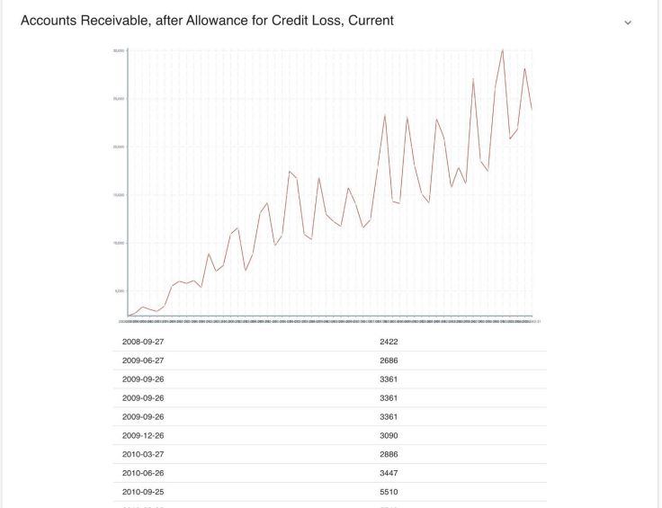

# SEC Filing Analyzer

SEC Filing Analyzer is a web application that automates the process of finding anomalies in financial information disclosed by companies in their quarterly filings with the SEC. It uses Python in the backend and React.js in the frontend.

## Features
Users can enter a stock ticker and the application fetches, parses and analyzes data fetched from the SEC EDGAR database to find anomalies in important financial metrics.
The application compares the new 10-k filings with previous data to identify anomalies and regression analysis.
The interface was designed to be intuitive, maintainable, and highlight the important metrics that caused anomalies.

## About
This project was created by [Eliyahu Levy](https://github.com/EliMLevy), [Oze Botach](https://github.com/Ozeitis) , [Azriel Bachrach](https://github.com/azrielb1), [Max Friedman](https://github.com/MaxF8), Koby Rosinsky, [Asher Kirshtein](https://github.com/AsherKirshtein/ProjectsWhileInYU-main), [Natalie Buchbinder](https://github.com/buchbindern), and [Yaakov Baker](https://github.com/YaakovBaker). It was built in 8 hours during the 2023 YU Hackathon. We are proud to share that after being judged against several other teams, it was awarded first place in the competition. 
